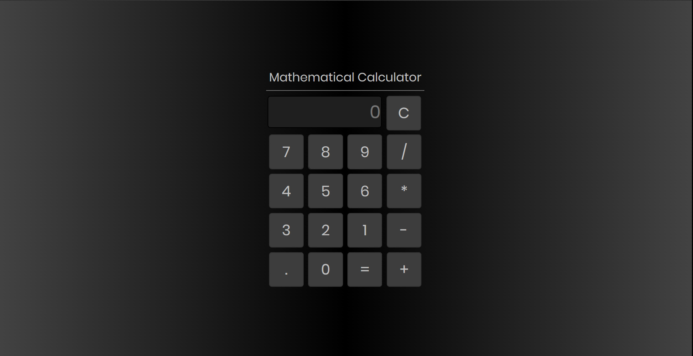

# Calculator
Simple mathematical calculator based on html, css and javascript.
# Contents:
- Front end: index.html and style.css
- Back end: script.js
# Screenshot:

# Made with:
- HTML
- CSS
- Javascript
